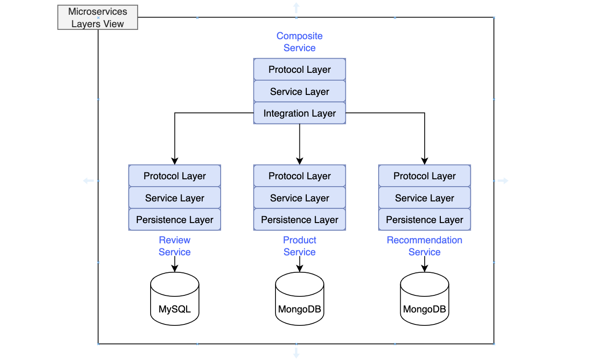

# ecommerce-microservices

Generic microservices project for an imaginary ecommerce site. The high level design can be depicted as follows:


<br/>

## Services Layers View

The microservices layered image below includes all the services split into different layers encapsulating different
responsibilities around business logic (Service Layer), communication (Protocol Layer) and data (Persistence Layer)
functions.



The diagram is depicted without added complexity to highlight as well interactions, at the persistence layer, with
different database technologies used by the services.

The composite service, on the other hand, lacks a persistence layer but contains an _Integration Layer_ which aggregates
the information retrieved from the different services pertaining to different contexts (Products, Reviews, etc.) and is
used to handle the communication with the three core microservices.

<br/>

### Running the application in Docker Compose

First, we build our deployment artifacts with Gradle and then the Docker images with Docker Compose, by running

```
/[root_folder]/gradle build
```

And,

```
docker-compose build
```

Then, we need to verify that we can see our Docker images, as follows:

```
docker images | grep ecommerce-microservices
```

Start up the microservices landscape with the following command:

```
docker-compose up
```

The -d option will make Docker Compose run the containers in detached mode, the same as for Docker:

```
docker-compose up -d
```

The logs can be observed by running:

```
docker-compose logs -f
```

Finally, _the composite service can be queried (and all of them internally)_ by running:

```
curl localhost:8080/product-composite/123 -s | jq .
```

The name is the one defined in the REST controller mapping for the composite service interface (ProductCompositeService.)

#### Inspecting Docker Compose Databases

To start the MongoDB CLI tool, mongo, inside the mongodb container, run the following command:

```
docker-compose exec mongodb mongosh ––quiet
> show dbs
```

To start the MySQL CLI tool, mysql, inside the mysql container and log in to review-db using the user created at startup, 
run the following command:

```
mysql -h localhost -P 3306 --protocol=tcp -u root -p review-db
mysql> show tables;
```
```

Finally, to stop docker compose, and stop all services running, execute:

```
docker compose down
```

<br/>

### Running the Bash Integration Tests

To execute the bash script to run integration tests on the product-composite service (and by transitivity in the services
it calls), the following shell script can be executed from the root of the project (sudo is not needed). 

./test-em-all.bash start stop

**WARNING:** Docker must be installed on the host machine that runs this command.

**WARNING 2:** If changes are made to the projects, the images of those might be cached locally in Docker. So it's better
to run the following:

- Delete docker images
- Build the whole landscape or the service of interest.
- Run again the test-em-all.bash script as indicated above.

<br/>

### Accessing the OpenAPI Documentation for the Microservices

The Documentation offers in this project general descriptive information about the API, such as:

- The name, description, version, and contact information for the API
- Terms of usage and license information
- Links to external information regarding the API, if any

_To access the API documentation_:

- Run `docker compose up`, if needed, check before the services containers are not running by executing the following
command `docker ps | grep 'ecommerce'`.
- Then, to browse the OpenAPI documentation, use the embedded Swagger UI viewer. Open the http://localhost:8080/openapi/swagger-ui.html URL in a web browser

### Troubleshooting

#### Linux

- Test Container test cases are failing due to "Could not find a valid Docker environment"

In some cases, it might be necessary to grant added permissions for TestContainers, which create ephemeral docker
images during Persistence/Integration tests, the following link should help: https://stackoverflow.com/questions/61108655/test-container-test-cases-are-failing-due-to-could-not-find-a-valid-docker-envi
